# How it works

One automated flow: competitors' live Facebook ads go in, the single best ad plus a ready-to-shoot creative comes out. Every box below is a real decision, in plain language.

```mermaid
flowchart TD
    A["<b>1 · Scrape</b> &nbsp;<i>(Apify · ~$1/run)</i><br/>competitors' ads from the public Meta Ad Library<br/><i>both live AND paused ads</i> — the paused ones reveal a message's real history"]
    G{"<b>2 · Three gates</b> — keep only real contenders<br/>running today &nbsp;·&nbsp; not a retargeting ad &nbsp;·&nbsp; sells a Guidde use case"}
    A --> G
    G -->|"product / how-it-works ads"| P["<b>3 · Product lane</b>"]
    G -->|"awareness / lead-gen ads"| T["<b>3 · Awareness lane</b>"]
    P --> PS["<b>4-5 · Score, two rounds</b><br/>Round 1 — inside each brand: most <b>proven</b> ad &rarr; its champion<br/>Round 2 — across brands: most <b>validated by rivals</b> + <b>closest to Guidde</b>"]
    T --> TS["<b>4-5 · Score, two rounds</b><br/><i>the same two rounds, run inside this lane</i>"]
    PS --> PW["<b>&#11088; Product winner</b><br/>the ad Guidde rebuilds"]
    TS --> TW["Awareness winner"]
    PW --> C["<b>6 · Create</b> &nbsp;<i>(Higgsfield via Claude · ~100 credits/ad)</i><br/>winner &rarr; ad breakdown &rarr; brief &rarr; storyboard &rarr;<br/>generated frames + produced video"]
    CFG(["<b>config.py</b> — one file holds every setting<br/>which brands · the scoring weights · the thresholds"])
    CFG -. sets the rules for .-> G
    CFG -. sets the rules for .-> PS
    classDef cfg fill:#F1EEFF,stroke:#6D4AFF,stroke-dasharray:4 3,color:#17161C;
    class CFG cfg;
```

The two lanes exist so a "download the report" ad never competes head-to-head with a product ad; each lane crowns its own winner, and the **product winner** is the one worth rebuilding. Solid arrows are the **flow**; the dotted arrows are **control** — the single `config.py` file sets the rules every step follows, so any result traces back to a decision you can see and change.

## The reasoning, in one pass (this is what's being graded)

- **Scrape live *and* paused ads.** Meta hides spend and performance, so "best" has to be inferred. Paused ads are a message's back-history: reading them is how we tell a message the brand keeps re-committing to from a one-off. (Official Meta API won't help, it only returns political ads.)
- **Three gates before scoring.** Running today (a paused ad tells us nothing about now), not a retargeting ad (wrong benchmark for a cold-audience ad), and sells a Guidde use case (checked against guidde.com).
- **Two rounds, on purpose.** Round 1 is *within* a brand, so a brand that simply runs more ads can't crowd the board; it picks each brand's most-proven ad. Round 2 is *across* brands. It uses two signals because market-validation alone **tied the three finalists** (identical angle coverage) — closeness-to-Guidde broke the tie on merit, and it's what makes the winner the best ad *for Guidde*, not just any well-worn ad.
- **Where it meets reality.** "Best" is a defended inference, not a measured fact. Tagging is keyword-based (transparent, can mislabel at the edges). Dynamic ads reset their own dates, which is exactly why we read the paused history. These limits are handled, not hidden.
